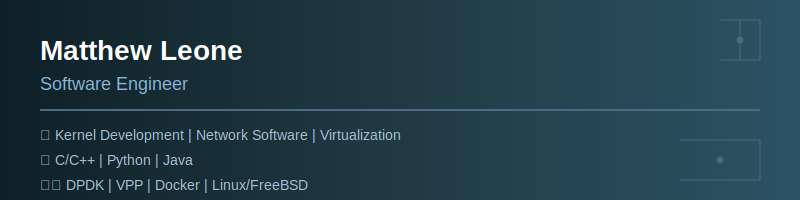

# Hello! I'm Matt 👋

Software Engineer

- 💬 Interested in connecting? Reach out to me via my <a href="mailto:matthew.leone.tech@gmail.com">email.</a>

## 🔗 My Links

## 🌟 Current Projects

- **[InfraMatrix Global Systems](https://github.com/InfraMatrix/IGS)** 🟣: **InfraMatrix Global Systems(IGS)** is an open-source hyperscaler designed to revolutionize cloud computing.

## 📈 My GitHub stats

  

     

  

     

### 
⚙️ My development environment 

> I primarily program on a Windows system, but all of my development and production systems run Linux on Ubuntu.

  <table style="font-size: 11px">
  <tr>
  <td valign="top" width="50%">

#### 🖥️ Windows User

I prefer using Windows specifically for the look and feel:

  </td>
  <td valign="top" width="50%">

#### 🐧 Linux Lover

I use Linux for software development and building systems:

  </td>
  </tr>
  </table>

---